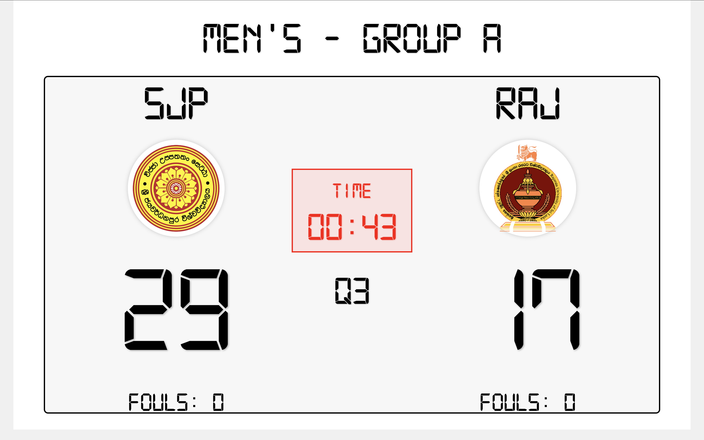
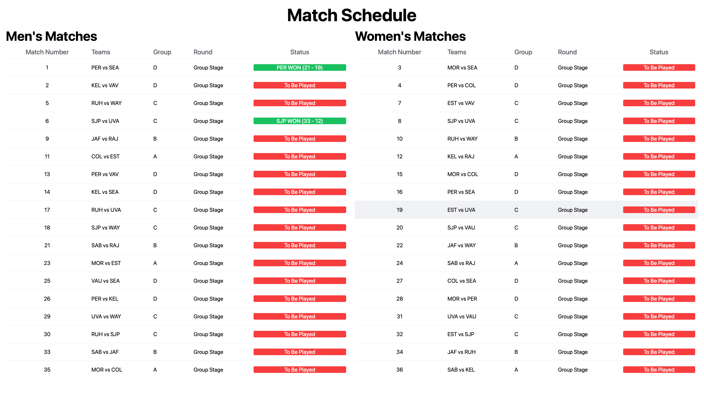
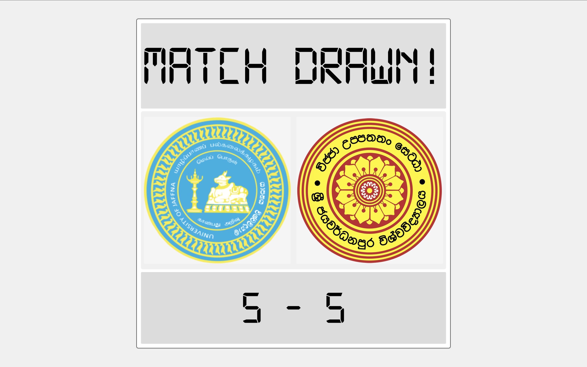
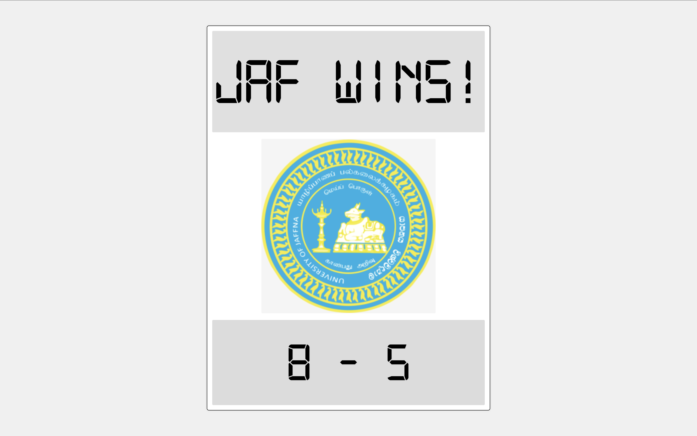
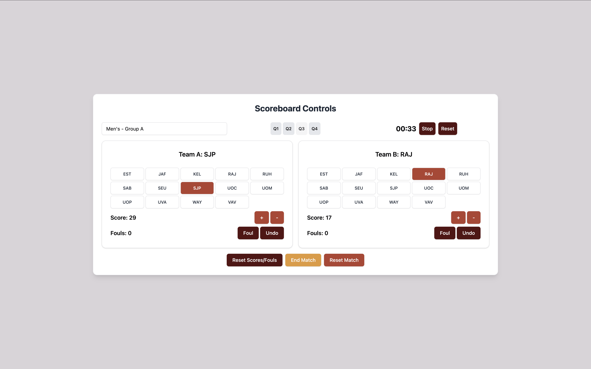
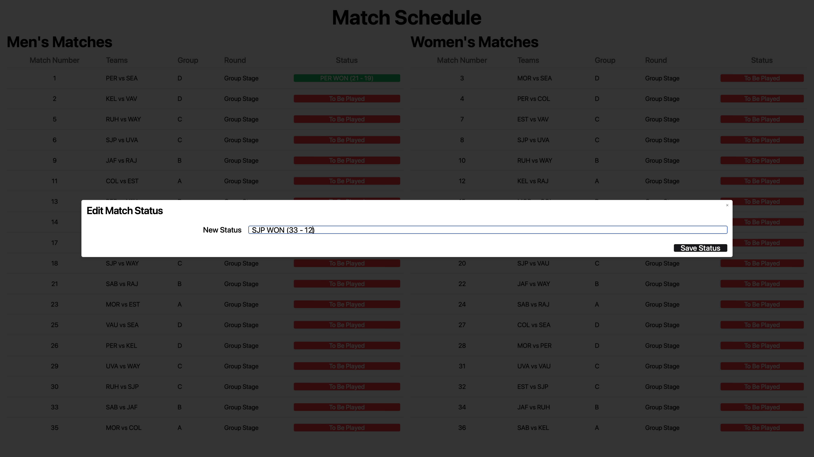

# Tournament Scoreboard for INTER UNIVERSITY GAMES 2024 - Basketball

This project is a web application built with **Next.js** to manage and display the scoreboard for a basketball tournament. The application utilizes React hooks such as **useState**, **useContext**, and **useEffect** for state management, and it uses **localStorage** to persist data across sessions. The app provides a user-friendly interface for managing team scores, tracking fouls, controlling the game timer, and updating match statuses.

## Features

- **Team Selection:** Choose from a list of predefined teams with logos.
- **Score Management:** Update the scores for both teams during the match.
- **Fouls Tracking:** Record fouls for each team.
- **Timer Control:** Start, stop, and reset the game timer.
- **Match Status:** End the match and reset it when necessary.
- **Persistent State:** The app persists the match data using `localStorage` to ensure data is retained even after a page refresh.

## Technologies Used

- **Next.js:** A React framework for server-side rendering and static site generation.
- **React:** Core library used for building the user interface.
- **React Hooks:** `useState`, `useContext`, and `useEffect` for managing state and side effects.
- **shadcn/ui:** Component library for building the user interface.
- **LocalStorage:** Used to persist the state across page reloads.

## Interface Overview

### Scoreboard Display

This is the primary interface where the scores, team logos, match status, and other important details are displayed.



### Match Schedule

View the match schedule, including all teams, match numbers, groups, rounds, and the current status of each match.



### Match Ended - Draw

If the match ends in a draw, the scoreboard will reflect this outcome.



### Match Ended - Winner

When a match has a winner, the winning team's logo and score will be highlighted.



### Scoreboard Controls

This interface allows the user to control the scoreboard, including selecting teams, updating scores, managing fouls, and controlling the timer.



### Edit Match Status

An interface for updating the status of a match.



## Getting Started

### Prerequisites

Ensure you have the following installed:

- Node.js
- npm or yarn

### Installation

1. Clone this repository:

    ```bash
    git clone https://github.com/anukah/scoreboard.git
    ```

2. Navigate to the project directory:

    ```bash
    cd scoreboard-app
    ```

3. Install dependencies:

    ```bash
    npm install
    ```

    or

    ```bash
    yarn install
    ```

### Running the App

1. Start development server:

    ```bash
    npm run dev
    ```

    or

    ```bash
    yarn run dev
    ```
